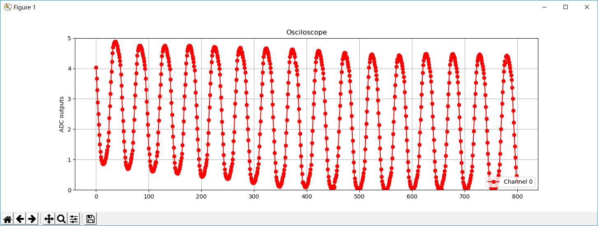

# Arduino-Oscilloscope
This is an oscilloscope, data captured by Arduino and plotted by Python.
It can show a rough image of the wave.

## Environment
1. Arduino UNO
2. Python 3.6.5

Theoretically, it can run under any version of Arduino and any version of Python.

## How to start
1. Upload [Arduino-Oscilloscope.ino](Arduino-Oscilloscope.ino) to Arduino.
2. Connect Pin 2 and Pin 3. Use Pin A0 as an input.
3. Run [monitor.py](monitor.py).

## Known fact
When i add the speed and points it will not be real-time. The bottle-neck seems to be the plotting speed of matplotlib. 
The Baud rate supported by Arduino can be up to 2000000. So there's possibility to improve sample rate.

I've test it in a Baud rate of 115200. At this Baud rate, the oscilloscope can work at around 2kHz.
Present max sample rate without plotting can be 8kHz.

## TODO
Add easy control of x range and y range.
Improve performance, make it more real-time.
